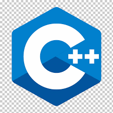
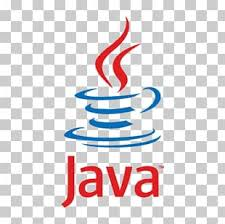
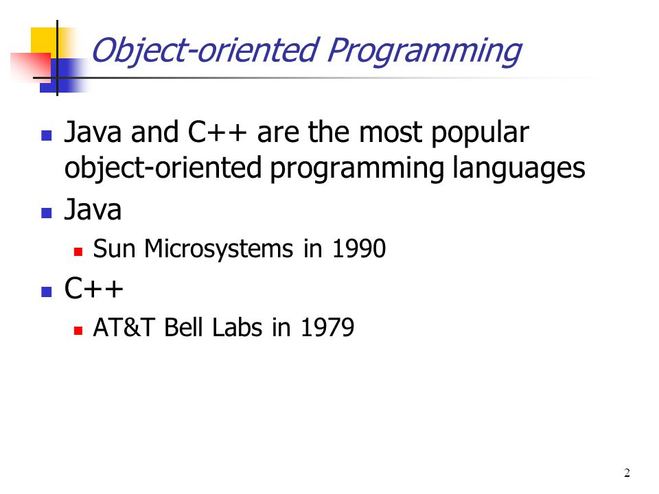

**`C++`** and **`Java`** are among the big names in the world of programming. These two computer programming languages are very popular because of their wide applications.

Learning C++ and Java will give you a foundational understanding of programming. So anyone who is new to programming is generally recommended to learn any or both of these languages before moving on to other 
languages and technologies. This is the reason why schools and colleges that teach programming have C++ and/or Java as mandatory subjects so that the students can get a good idea of what programming is.


##Overview:

**`C++`** is an object-oriented, multi-paradigm, functional, imperative, procedural, and a general-purpose computer programming language. Basically, it’s an extension of the C language. It was also known as C with classes. Besides the OOP features, it has all the features of the C language.

**`Java`** is an object-oriented programming language with all the high-level features. James Gosling from Sun Microsystems originally developed this language. Later, Oracle acquired this company in 2010.

This OOP language is also a general-purpose language and it’s a class-based, imperative, generic, multi-paradigm, and reflective computer language. Compared to C++, it does not give you much freedom to perform low-level memory manipulation.

##Real-life uses:
**`C++`** is used for building operating systems, desktop apps, web browsers, rendering engines of web browsers, machine learning libraries, applications that involve heavy graphical processing, databases, embedded systems, mobile apps, and so on.

On the other hand, **`Java`** is used for building app servers, web apps, mobile apps, desktop apps, unit tests, enterprise applications, games, cloud applications, web APIs, and so on.


##Popular C++ applications:

Great companies such as Adobe, Amazon, Apple, AT&T, Autodesk, Bloomberg, Facebook, Google, HP, IBM, Intel, Microsoft, and Mozilla are using C++.
Some popular C++ applications are Photoshop, Illustrator, Acrobat, InDesign, Maya, Chrome, Java VM core, Windows XP, Windows Vista, Windows 7, Windows NT, Windows 9x, Microsoft Office, Internet Explorer, Visual Studio, Mozilla Firefox, and so on.


##Popular Java applications:

Some popular Java applications are JPC, ThinkFree, NASA World Wind, Tommy Jr, Blu-ray BD-J, UltraMixer, Project Looking Glass, Sun SPOT, Eclipse, Netbeans IDE, and so on


##DIFFERENCES: 👊👊👊👊

1.**` Simple Hello World Program`**

```cpp
C++:
#include<bits/stdc++.h>
using namespace std;
int main()
{
	cout << “Hello, World!”;
	return 0;
}
```

```java

Java:
public class SimpleProgram
{
	public static void main(String [] args)
	{
		System.out.println(“Hello, World!”);
	}
}
```


2.**` Interpreter-Compiler`**
C++ is a compiled language whereas Java is both compiled and interpreted language.


3.**` Closeness to Hardware`**
When compared to Java, C++ is a low-level language, it’s closer to the hardware. Java is not close to the hardware


4.**` Cross Platform Apps`**
Java is platform independent that ,i.e, it can run on any computer/platform on which we have a JVM installed.
C++ won't run on other operating systems.We need to recompile for different OS to run it.


5.**` Pointers`**
C++ has complete Pointers support.Java has limited Pointer support.


6.**`Threads`**
Java supports threads but C++ doesn't support it.


7.**`Default arguments`**
C++ supports default arguments whereas Java doesn't have any such thing.


8.**`Destructor`**
C++ supports Destructor whereas Java doesn't.


9.**`Inheritance`**
Java doesn't support Multiple Inheritance whereas C++ does support it.


10.**`Operator Overloading`**
C++ supports overloading operators according to the convenience of the programmer whereas Java doesn't have this facility.


11.**`Structs and Unions`**
C++ supports these user defined datatypes whereas Java doesn't.


12.**`Memory Safety`**
C++ is not a memory-safe language. You can perform memory management, which is a great advantage. But memory errors may occur and serious issues like crashes may take place at the time of the program’s
execution. On the other hand, Java doesn’t allow memory manipulation, it’s system controlled. So this kind of issues will not appear. Java is a memory-safe language.


##SIMILARITIES:🤝🤝🤝🤝

1.**` Syntax`**
Both have comparable and easy to understand syntaxes.


2.**` Object Oriented`**
Both are Object Oriented Languages.

3.**` Main`**
Execution starts from the main() function in both the languages.


4.**` Comments`**
Comments are identical in C++ and java


5.**`Basic Structure`**
Primitive data types, loops, conditional statements, conditional operators, arithmetic operators, classes, variable definitions, variable initializations, value assignments, etc. are similar.


##Conclusion:
We have learned from this article that both C++ and Java are powerful languages. You can consider learning both of them to get a solid understanding of computer programming.

But if you want to choose one between the two, ask yourself what kind of applications you want to build. For example, for building a Windows applications, C++ is an ideal choice. And if you need to build app:
servers, enterprise applications, etc., you can select Java.


