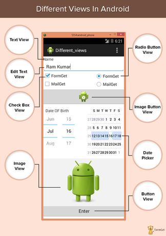
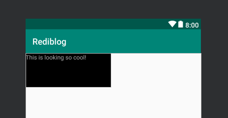
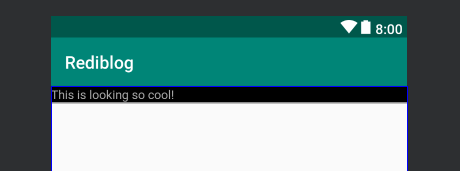

Now that you can now [create a new android project using android studio](/android-start-building-apps), we shall see how android apps are designed.

---

##Components

Android apps majorly contains two components:

- **Resources**: This comprises your layout designs, images, values, themes etc.
- **Java code**: This contains the logic of your app i.e., how app reacts to different user inputs or how different resources are related to each other etc.

Lets first dive straight into the resources part which will help us design our apps.

##Views

First thing we would want to look into is **view**s. In android, a view is a rectangular area on the screen which displays some content. It may be some text, image, video or anything. A **Viewgroup** is a container of views or other viewgroups which defines some rules according to which its children are positioned within it. These all make up the UI (User Interface)!

There are many different types of view. Some are listed below:

- _TextView_: Used to display some text on the screen.
- _ImageView_: Used to display images.
- _Button_: Obviously buttons!
- _EditText_: Used to get user input.

Some of the view groups are- _LinearLayout_, _RelativeLayout_, _ConstraintLayout_ etc.



😅 So many new words! Don't worry you need not memorize them, no one needs to! You can always refer to [this vocabulary](https://developers.google.com/android/for-all/vocab-words/) anytime you like.

##TextView

Lets take a look at our first view - _TextView_ 🤩

This is how a code for creating TextView looks like-

```XML
<TextView
  android:layout_width="200dp"
  android:layout_height="80dp"
  android:background="@android:color/black"
  android:text="This is looking so cool!"
  android:textColor="@android:color/darker_gray"
/>
```

This is how it looks-

Pretty cool! right?

#####So, what did you observe when you first saw the code?🕵

The weird syntax probably? In case you don't know, this is XML. Yes! We use XML to design our layouts in android. Though we can build layouts completely by drag & drog and other fucntionalities provided by Android studio but directly coding using XML, though adds some complexity is very flexible and we have total control over it!

####XML

Lets look at XML very briefly. A general XML syntax looks like this-

```XML
<!-- This is a comment in XML -->

<!-- The tag name, followed by attributes -->
<TagName attr1="attribute 1 value" attr2="attribute 2 value">
  <!-- Its children, if any -->
  <Children />
<!-- Closing tag -->
</TagName>
```

So, a XML tag starts with an opening angular bracket `<` followed by the tag name and its attributes. Atributes define the properties of the tag. If it has no children, it is closed by `/>`. If it does have children, we follow the syntax shown in above code.

This was a really short introduction to XML. To learn more visit [this](https://www.w3schools.com/xml/) page. **Note**: For android development, you just need to read upto [XML namespaces](https://www.w3schools.com/xml/xml_namespaces.asp).

####Some attributes

Lets look at some attributes that can be used to make some awesome layouts.

#####`wrap_content` and `match_parent`
Lets change our code a bit. Suppose we change our TextView as such:

```XML{2-3}
<TextView
  android:layout_width="match_parent"
  android:layout_height="wrap_content"
  android:background="@android:color/black"
  android:text="This is looking so cool!"
  android:textColor="@android:color/darker_gray"
/>
```

This is the result-

You might have already guessed by the code and image what they are doing. `wrap_content` makes the view occupy only the space that is required while `match_parent` takes up all the available space to the view.

#####Few more attributes
While discusing about TextView, you might have observed that `background` helps to change the background. We can set the background to a color, pattern or even an image! `textColor` as the name suggests is used to change the color of the text. We can change the text size as such: `android:textSize="40sp"`.

---

By now you might have got an idea about XML and how android layouts are built. Next we will try to [build a simple android page for a famous monument - Taj Mahal](/android-simple-page) and learn how different types of android views and viewgroups work!🎉

<div style="width: 100%; display: flex; justify-content: space-between;">
  <span>Prev: <a href="/android-start-building-apps">Start building apps</a></span>
  <span>Next: <a href="/android-simple-page">Simple android page</a></span>
</div>
