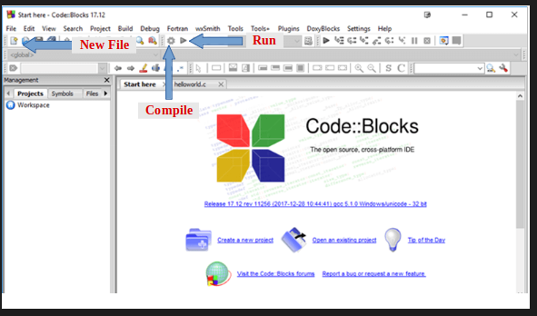
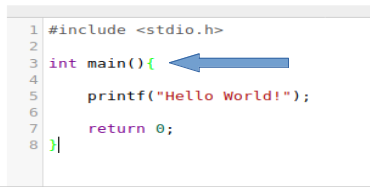
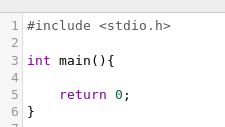

If you had a little knowledge about any of the programming language then this blog is not for you. It is for absolute beginners who have never heard of programming.

Let’s start. If you know nothing then you must have one of the following questions -

1. Why should I learn a programming language?
2. When I am the one who is writing the program and I know how to do that task then why should I write a program for it ?

We will understand the answer for both the question together as we proceed. Please read it completely and don’t skip the parts.

For your knowledge we will start learning C language.
But for now just forget about these things. First of all you need a platform where you run your code. You can install any IDE (no worries if you never heard of this word) OR you can use an online one.

As an IDE you can use CodeBlocks. Follow the steps [here](https://www.guru99.com/c-gcc-install.html). It is highly recommended not to use any of the online IDE now!

If you have followed the steps correctly then it’s the time to write your first program.

1. Open codeblocks and create a new file.



2. Copy and paste the following code

```c
#include <stdio.h>

int main(){
	printf("Hello World!");
	return 0;
}
```

3. save the file and compile it (see the figure above)
4. Run the code.

You will see ‘Hello World!’ on the screen.

Now, look at the above code. Currently you need not to understand the whole thing. Just understand that you will write your code inside the curly braces



You must have question that what this shit is?
What is the meaning of the lines written by you and what does it do ?

Currently, we will not understand each and every line of the above code. Just keep in mind that the above are neccessary lines for writing any code.



So, this is the template for now. You should write atleast these lines.

Now, to print anything on the screen we have to use **printf**.
We have to write the line we want to print in the double quotes inside printf.

The syntax is : **printf(“......”);**

Notice the **semicolon(;)** at the end. It denotes the end of current statement (treat it as end of a command). Without this you will get a compilation error. (Don’t worry we will talk about compilation word later)

Go ahead and try printing different things :)
