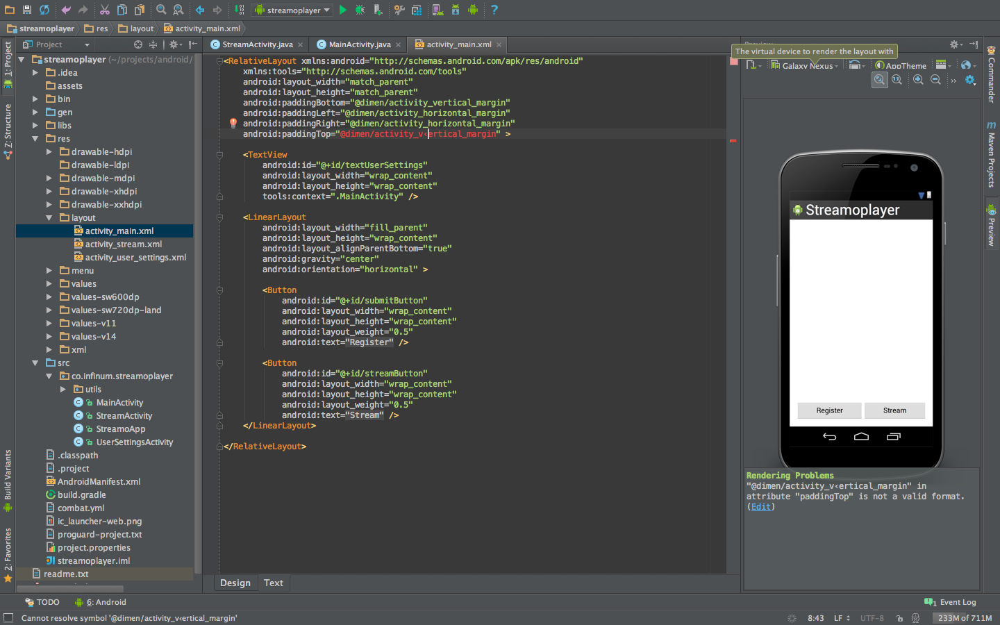
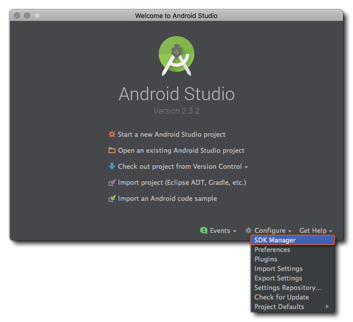

If you want to get started with android app development, then probably you are at the right place. So lets get started!😊

---

## Getting Started!

#### First of all! What is Android?

Android is a Linux-based operating system developed by Google. It is an open-source software which means anyone can download its source code, use or modify it. Though it was primarily built for smartphones, it has also found its usage in TVs, cars, wrist watches and alot.

#### Now that I know what android is, how do I start developing apps for it?🤔

Android app development is primarily done in **Java** (or, Kotlin). Though there are other methods such as Flutter, React Native and many more, we will stick with the Java way.

To develop android apps, we will use an IDE called **Android Studio** (based on IntelliJ IDEA) specifically designed for making android apps. Initially it might be difficult to understand and use but believe me, it is one of the best IDEs ever made.

#### Structure

Android app development is generally divided into 3 sections.

| 1. Design                                                                                                                                                                                                                                                                                                                          | 2. Develop                                                                                                                                                                                                                                                                  | 3. Distribute                                                                                                                                                                           |
| ---------------------------------------------------------------------------------------------------------------------------------------------------------------------------------------------------------------------------------------------------------------------------------------------------------------------------------- | --------------------------------------------------------------------------------------------------------------------------------------------------------------------------------------------------------------------------------------------------------------------------- | --------------------------------------------------------------------------------------------------------------------------------------------------------------------------------------- |
| Before you write a single line of code, you need to design the user interface and make it fit the user experience. Although you may know what a user will do with your app, you should pause to focus on how a user will interact with it. Your design should be sleek, simple, intuitive, and tailored to the Android experience. | Once your design is finalized, all you need are the tools to turn your app ideas into reality. Android's framework provides you the APIs to build apps that take full advantage of device hardware, connected accessory devices, the Internet, software features, and more. | Now your app is complete. You've built it to support a variety of screen sizes and densities, and tested it on the Android emulator and on real devices. You're ready to ship your app. |

## GO!

Time to install the right tools to develop your amazing android apps. 😀

#### Step 1 - Install JDK

Since we will develop our android apps using Java, we will need Java Development Kit.
In case you haven't installed JDK yet/don't know how to, visit [this](https://stackoverflow.com/questions/14788345/how-to-install-the-jdk-on-ubuntu-linux) link to install on linux or watch this video for windows.
`youtube:https://www.youtube.com/embed/Wp6uS7CmivE`

#### Step 2 - Download [Android Studio](https://developer.android.com/studio/index.html).

- Android Studio is an IDE specially designed for Android App Development.

#### Step 3 - Setting up android studio.

Now that you have downloaded android studio, you are all set to install and use it.

Now, you can launch the Android Studio's installation file to proceed. Select an appropriate path for Android Studio, Android _SDK_ (A selection of tools including android platform itself) and _Android Virtual Machine_ (An emulator to test your apps on).
When you go through the installation, **make sure** you _leave the boxes ticked to confirm that you want these additional components_. You could manually add them later, but this will just complicate matters.

When you launch Android Studio, you will be presented with a menu where you will be able to get started or configure some options. Here, you should familiarize youself with **SDK Manager** (Configure - > SDK Manager) which is where you’ll update your Android SDK to support newer versions, as well as download things like code samples or support for Google Glass and more. Don’t worry about that now but if Android Studio says you’re missing something, this is where you’ll probably need to go to find it.

Now, you are all set to start building android apps! **CHEERS**! 🍺

---

So there are mainly three things interacting when you use Android Studio to create your apps -

- Android Studio itself.
- The code you write in Java and XML.
- And the Android SDK which you’ll access through your Java code.

Next: <a href="/android-start-building-apps">Start building apps</a>

