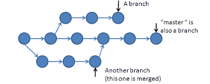

So you've learned something over the past few weekends and feel like you just wasted a lot of time trying to get the initial setup correct because the documentation sucked. You now feel like, "God, I wish someone wrote an easier introduction to this". Why not do it yourself?

If you'd like to write something on this blog but aren't really aware of the git and github workflow, hopefully this help you get started.

## Step 0 - Get Git/Github

If you're on Mac/Linux, you already have it.
If you're on Windows, you're fucked. JK. Look it up. (as an alternative to installing git on your Windows system, try getting the Windows Subsystem for Linux (WSL) from the Microsoft Store. Dual-Booting is a path, I won't recommend anybody to take)

On the other hand, getting github is as simple as making an account @ [here](https://github.com/).

## Step 1 - Locate and Fork

Once you've done the essentials and explored the github website a little it's time to make a contribution to someone's code.

Now, let's say you're exploring github and come across someone's repository (Project Folders on Git are usually known as repositories) you would like to make a contribution to. Usually, when you spot a bug in someone's code, or you want to implement/add something to the repository, you file an issue, in the issues tab. 
Once you file an issue, someone who manages that repository, will look into the issue and if you show interest in solving the issue, they might assign it to you for resolving it.

For now, since we are just looking to add our article to the blog, we will skip over this part. Head over to `https://github.com/ccjusl/squeue` . One the top left, you'll see a button saying 'Fork'. Click on it.

When you 'Fork' a repository, you are making a clone of it, for your own account. If you
look at your account now, you'll see a new repository at `https://github.com/YOUR_USERNAME/squeue`

## Step 2 - Creating a clone on your system

If you'd like to make changes to a repository, you can completely do it on the github website. But as you start doing more complicated changes, the workflow would get very messy. It's best to create a local clone on your system to work on the changes.

Head over to _your_ copy of the repository and click on the green button which says Clone/Download and copy the URL it contains. It should be something like `https://github.com/YOUR_USERNAME/squeue.git`

Now, open the terminal and type this out:
`git clone https://github.com/YOUR_USERNAME/squeue.git`
This will download the repository on your computer.

Move to the directory just downloaded.

## Step 3 - Creating a new branch

Now let's talk about branches.
Branches are used to develop features isolated from each other. When you create a new repository or clone it from somewhere(like we did), git creates a default branch for you called the _master_ branch.

When we want to make changes, we create a new branch and when we are done with making the changes, we can merge the branch with the master branch.

To check out the branches we have, just type `git branch`. The `*` sign you see next to one of the branches, indicates which branch we are on currently. If you are not currently on the master branch, switch to it using `git checkout master`.

Now, to create a new branch, we just append the new branch name to the `git branch` command. We will try to keep the names meaningful and call the new branch `xyz_post`.
Essentially, we would be doing something like: `git branch xyz_post`.

We might have created a new branch but if you do a git master, you will notice that we are still on the master branch. Let us switch over to the newly created branch:
`git checkout xyz_post`.

## Step 4 - Code and Commit the changes

If you look around the folder structure of the cloned repo, you will see that the posts are inside the `squeue/content/posts` folder.
Create a new directory with the name that hints at the article you are going to write. The articles are written in Markdown, which is super easy to pick up.

Once you've added it, just do `git status`, to see the status of the changes. Git will probably tell you that there are untracked files, which means that git has spotted that there are some files whose changes it cannot keep a track of. To add these to git's tracker, we do `git add .` (the `.` specifies the current directory)

Once we make some more changes, and we are finally ready to publish our article, we commit it. We usually add a commit message whenever we do a commit.
`git commit -a -m "submitted post on xyz"`.
It is not mandatory to add a commit message, but it is **always always** recommended to add it.

## Step 5 - Pushing the changes

Once your changes are committed, “push” the changes: send them to your GitHub repository(the one we forked) using `git push`

_The first time you try to push, git will tell you that it is not connected to a branch on the github server. Just do what the command tells you to do:_

    git push --set-upstream origin xyz_post

Let's understand this statement:
`origin` is a shorthand name for the remote repository that a project was originally cloned from. Here, it refers to the repository at `https://github.com/YOUR_USERNAME/squeue`. It is an industry convention to use `origin` to refer to this repository. You can use your own word in-place of origin, but there's no reason to do so.

By setting our **up**stream to origin, we tell git that when we want to **up**load our changes, it should be done to `origin` and we would we pushing the branch named `xyz_post`.

## Step 6 - Making a Pull Request

After you've pushed the changes to _your fork_, it's time to push it to the repository you forked it from. If you try to visit the page of your forked repository on Github, you can see the Compare & pull request button. Click on it and go through the steps and enter a commit message (might as well give the one you used on your local commit).
Doing this, makes a **_request_** to the original repository (_jusl/squeue_) to **_pull_** your added changes to their codebase.

Now wait until we review your **_pull request_** and accept it. Once we do, your post should be up on the blog :)

## Coming back to the repo in the future

Let's suppose you pushed some changes,made a pull request and it got accepted. Then you came back to the original repository (the one at jusl/squeue), a few days later, to see that a bunch of people had also made a few pull requests and the codebase looks a little different. This means, that now your local repository is obsolete since it does not reflect the current state of the original repository.

### Adding a Remote (one time thing)

Before you can sync, you need to add a _remote_ that points to the upstream repository.
What is a remote?
`remote`, refers to any remote repository, this includes your own forked repository and also any other repository on Github. `origin` is, by convention, the default remote name in `git`.
As I explained earlier, when we did a `git clone https://github.com/YOUR_USERNAME/squeue.git`, this got stored as a remote named origin.
We need to add another one of these, to fetch data from the original repository. For this we use,

`git remote add <remote_name> <remote_url>` obviously keep the <remote_name> different from `origin`

Here is what I did. You can see that the number of remote branches changed after I gave the command.

    [clickbait@ubuntu:~/d/jusl/squeue]$ git remote -v
    origin  https://github.com/karansinghgit/squeue.git (fetch)
    origin  https://github.com/karansinghgit/squeue.git (push)
    [clickbait@ubuntu:~/d/jusl/squeue]$ git remote add upstream https://github.com/ccjusl/squeue.git
    [clickbait@ubuntu:~/d/jusl/squeue]$ git remote -v
    origin  https://github.com/karansinghgit/squeue.git (fetch)
    origin  https://github.com/karansinghgit/squeue.git (push)
    upstream        https://github.com/ccjusl/squeue.git (fetch)
    upstream        https://github.com/ccjusl/squeue.git (push)

### Fetching from Upstream

Move to the master branch if you're not already on it.
`git checkout master`

And yeah, nothing else here, just the section title.
`git fetch upstream`

### Merging from Upstream

Once we've fetched the data, we just need to merge our local repository with the upstream's master branch.

`git merge upstream/master`

### Done?

Everything should be done be synced by now, right? Well, yes and no.
You've synced it with the local repo but if you check your fork at [github](https://github.com/YOUR_USERNAME/squeue.git), you will see that it is still behind the original repository by a few commits.
You can even check this via, `git status`
This is what it gave me,

    [clickbait@ubuntu:~/d/jusl/squeue]$ git status
    On branch master
    Your branch is ahead of 'origin/master' by 17 commits.
      (use "git push" to publish your local commits)

    nothing to commit, working tree clean

A quick fix for this is just pushing the changes as we did on step 5.
`git push origin master`

If you do a `git status` now, it should tell you that the working tree is now up to date and clean.

    [clickbait@ubuntu:~/d/jusl/squeue]$ git status
    On branch master
    Your branch is up to date with 'origin/master'.

    nothing to commit, working tree clean

NOW, Everything is synced. You can start making changes again, continuing from Step 3 everytime you want to make a contribution.

---

Hopefully, you have understood the basic workflow of working with git and are ready to start contributing. If you have any doubts, just ping me somewhere.

I have made a lot of typos and grammatical errors for you to find and fix by making pull requests to our repo. jk, I'm lazy as shit. all the best.
