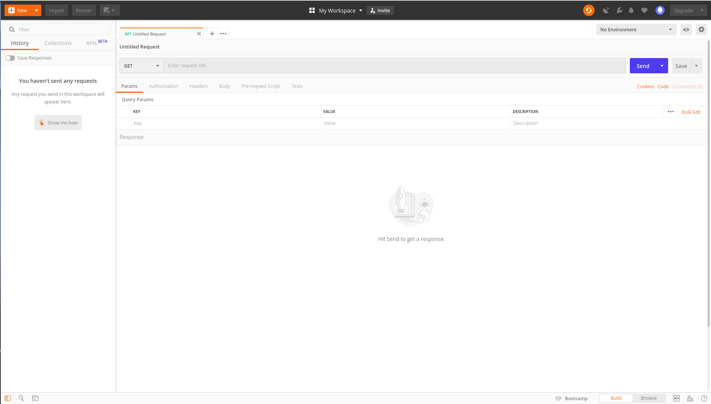
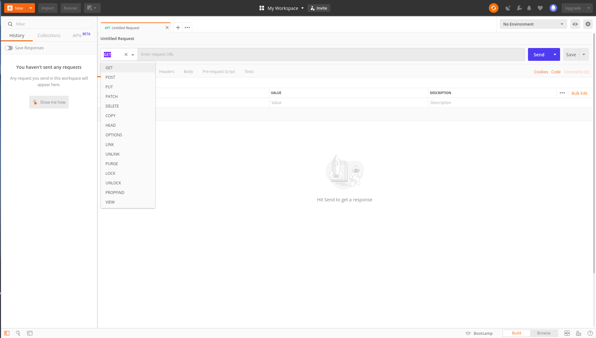
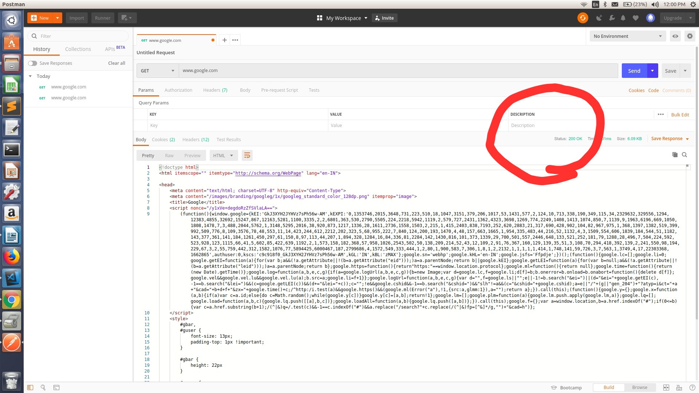
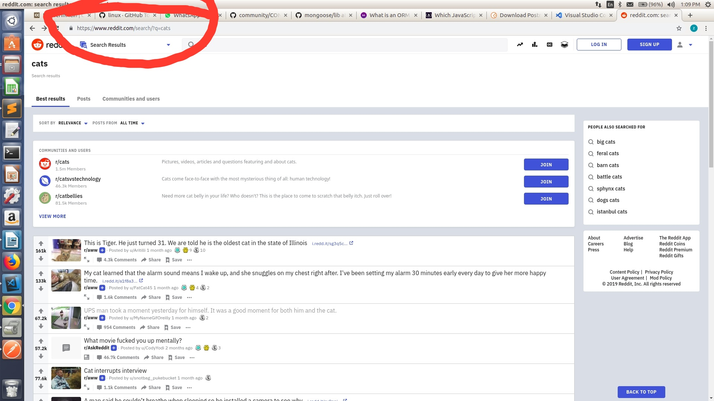

In the last blog we had a high level overview of the internet.In this blog we will try to have a deeper understaending of http.

Remember in the last blog I had said that where were a bunch of things that would occur when we type a url in the search bar of a browser and hit enter.Among the the most important thing was that your computer (i.e the client) will send **HTTP REQUEST** to the server and the server after understandig the request will send an appropriate **HTTP RESPONSE**.

Now it turns out that using the browser is not the only way to send an http reuest to a url.There are numerous alternatives for sending http requests like:
- from the command line.
- from a link in an application
- from a program in the backend itself.
- from an ios/android app 
- from many tools made for the purpose.

For a change today we will use a tool called **postman** to send and understand http.You can easily download postman from [here](https://www.getpostman.com/downloads/).After downloading and signing in you will see a page like this.

**REQUEST TYPE**

Now let's go ahead and make a request.The most important part while making a request is the url to  which we are making request.Additionally there is a choice besides the url search bar .It is the type of request that we want to send.We will go through some of the important ones below.

- **GET**    :  Is used when we want to retrieve data from a url.Like the html,css etc.A get request should not modify
                any data in the server end.
- **POST**   :  Is used to send data to the server.eg. file upload,student infromation upload,etc .
- **PUT**    :  Is used update information at any backend database.
- **DELETE** :  Is used to remove any data at a backend database.

An important point to note is that the above request types are just part of a protocol(Remeber http is a protocol **Hyper Text Transfer Protocol**).This means that using the above request types doesnot automatically do anything.It just suggest what the server should be expecting .For example if we use a post request the server would be expecting that this request will remove some data frm database.

Another important point to be noted is that the type of request is npt decided by the user but the developer of the application.

**THE RESPONSE**

So i have made a **GET** request to **www.google.com** .Below we can see the response sent by the sever.There are several parts to the response.The first tab that you woud be able to see is the body.It is the actual payload as in the actual contents sent by the browser in response to your request.

Here we can see the body contains html & css . This is again what you see when you search the browser for www.google.com.The browser parses this response.You will see the exact code is you view the page source in you browser(ctrl+I).

Another part is the head which contains meta data about the response like the type of reponse (text,html,etc) and others.

A special mention here has to bee the  **status code** as you could see the status code here is **200**.It means that the get request was successful and the response will be as expected.Any failure generates a statuc code starting with 4 or 5.for example if the page searched was not found the server sends back an empty response with status code **404**.You can learn a lot about status codes [here](https://www.tutorialspoint.com/http/http_status_codes.htm)

**REQUEST PARAMETERS**

As said earlier we can make a request from the search bar of a browser.All the request made here are **get** type requests .**We cannot make request of any other type other than get from the url search bar**.

The **post** request contains information in its body i.e the information that needs to be sent to the server,for example the information of a facebook post that we are uploading.But a get request doesnot have any information in its body.But still we can send some information to the server in a get request.Here's how.
At this point let me make a request to reddit.com from my chrome browser.Below is the homepage for reddit.

Now let me search cats in the reddit search bar and hit enter.Since i am making a request from a search it has to be a get request .So how does the server know that we want to search about cats . Obviously we need to send some information to the server like the heywords searched.
Just pause and have a look at the url.It would look something like :

https://www.reddit.com/search/?q=cats

Notice the part after the **'?'** .Here q is what is called a **parameter** and the corresponding value for our case is cats.This parameter value is sent in the head portion of the request and not in the body.Now the if the server searches for the value q it will get the value cats and will be aware that the user is asking for cat posts.There can be multiple parameters concatenated by ampersand '&'.Here is a demo 

https://www.reddit.com/search/?q=cats&name=fad

Now let make the same request in postman.Click the params tab and give the name of the parameter 'q' and the value 'cats'.Send a get request to the url https://www.reddit.com/search/ .You will get more or less the same response.

You can add as much parameters as you want.The server uses only those parameters which it is aware of and ignores the rest.

That's all for today.Next we will see how to install nodejs in your machine so that we could get started writing our own server.