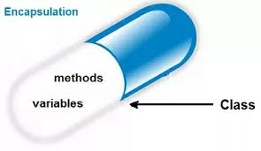
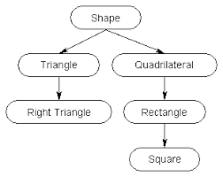

If you sit for any technical interview be it for Microsoft( product based ), DE Shaw( FinTech ) or TCS( service based ) the most frequent questions are related to Object-oriented programming(OOP). So in this blog we will try to get an overview of what is OOP and will understand all it's features in depth, readers are expected to have basic understanding of cpp.

---

##WHAT IS OOP?

Object-oriented programming (OOP) is a programming language model in which programs are organized around data, or objects, rather than functions and logic.

So first let's understand **"What is an object?"**

Object is a data field with unique attributes and behaviour defined by it's class. It is basically an **instance of a class**.

Next question will be **"What is a class?"**

Class is user defined data type which has data members and functions. It can be referred to as a **blueprint** of objects which share common properties and behaviour.

Let's understand with an example:

Consider a class Car, any car of any brand have wheels, engine, speed, mileage, etc.these are properties of the class car, we can drive a car this is the behaviour of class car.

But we don't have existence of anything called car, what we have Maruti Suzuki Swift, Hyundai Santro, Mercedes Benz(everybody wants it :P),so these are objects or instances of class car.

```cpp
class Person
{
	String name;
public:
	Person(String personName):name(personName)
	{}
};

int main()
{
	Person p("Krishna Mishra"); // p is a person with name Krishna Mishra
}
```

---

##FEATURES OF OOP:

The Objects Oriented programming language supports all the features of procedural languages. In addition it supports some important concepts and terminology which has made it popular among programming methodology.

The most important features of Object Oriented programming are:

####Encapsulation  
####Abstraction  
####Polymorphism  
####Inheritance  

We will look into each of them in detail....

---

##ENCAPSULATION

In object-oriented programming, Encapsulation (also called **information hiding**) is the process of keeping the details about how an object is implemented, hidden away from users of the object. Instead, users of the object access the object through a public interface. In this way, users are able to use the object without having to understand how it is implemented.

We generally do it by making member variables private and functions public and we make sure that attributes are only accessed by these functions.

For example again consider Car, we know that we can stop car by pressing brakes, but we don't know how this brake functionality is actually implemented it is encapsulated from users of car.



###Benefits of encapsulation:

**Encapsulated classes are easier to use and reduce the complexity of your programs**

If a class is fully encapsulated then to use it we only need to know it's function names,what parameters it takes and it's return type.We can use it in the same manner until and unless these three things are the same irrespective of implementation.

For example a list of names can be internally implemented using map, vector, array, set, etc.
but users of class can use it in a consistent manner.

All of the classes in the C++ standard library are encapsulated. Imagine how much more complicated C++ would be if you had to understand how std::string, std::vector, or std::cout were implemented in order to use them!

**Encapsulated classes help protect your data and prevent misuse**

Global variables are accessible by everyone thus anyone can change it's value so is public class members.

For example, let us again consider our Car class, having attribute for number of wheels

```cpp
class Car
{
	public:
    int noOfWheels = 4;
};
```

As noOfWheels is public any user can change it's value to 3 or 5, imagine such a car XD.

We can also help protect the user from mistakes in using our class. Consider a class with a public array member variable:

```cpp
class Array
{
public:
    int mArray[10];
};
```

If users can access the array directly, they could subscript the array with an invalid index, producing unexpected results:

```cpp
int main()
{
    Array array;
    array.mArray[16] = 2; // invalid array index
}
```

However, if we make the array private, we can force the user to use a function that validates that the index is valid first:

```cpp
class Array
{
private:
    int mArray[10]; // user can not access this directly any more

public:
    void setValue(int index, int value)
    {
        // If the index is invalid, do nothing
        if (index < 0 || index >= 10)
            return;

        mArray[index] = value;
    }
};
```

In this way, we’ve protected the integrity of our program.

**Encapsulated classes are easier to change**

Consider this simple example:

```cpp
class Value
{
public:
    int mValue;
};

int main()
{
    Value v;
    v.mValue = 5;
    std::cout << v.mValue << '\n';
}
```

While this program works fine, what would happen if we decided to rename mValue, or change its type? We’d break not only this program, but likely most of the programs that use class Value as well!

But if class was encapsulated and m_value was only accessible by member functions then we could have easily changed the class without breaking user code.

---

##ABSTRACTION

Abstraction is modelling a data type without implementation details. It means displaying only important information to users and hiding the details similar to ENCAPSULATION.But both of them are not the same there is a subtle difference between these concepts.Abstraction solves the problem at **design** level while encapsulation does that at **implementation** level.
Abstraction lets you focus on what the object does instead of how it does, while Encapsulation means hiding the internal details of how an object works.

Let us take an example of television. Encapsulation is the internal circuits, LEDs, etc that combine to make it a TV. Abstraction is the on-off, sound, channel setting and other buttons provided to operate it.

Abstraction is used to implement **polymorphism**.

---

##INHERITANCE

Consider triangle and quadrilateral although they are different shapes they have features in common as they are shape. All shapes have perimeter, area, etc.

We can say triangle and quadrilateral inherit these features from shapes.

Inheritance forms an "**is a**" relationship. Triangle is a shape, apple is a fruit and so on.



```cpp
class Shape
{
    int perimeter,area;
};

class Triangle: public Shape
{
    
};
```
So Triangle is a shape, thus it is a **derived** class of Shape which is **base** class.Triangle inherits features area
and perimeter from Shape.

###Benefits of inheritance:

**Reusability**- Allows derived class to use base class public functions this reducing code duplication.

**Extensibility**- extend the base class logic in derived class

**Overriding**- We can override base class function in derived class to change it's functionality.

---

##POLYMORPHISM

First we need to know **"what is virtual function"**?
A virtual function is a special type of function that, when called, resolves to the most-derived version of the function that exists between the base and derived class.

```cpp
class Base
{
public:
    virtual const char* getName() { return "Base"; } // note addition of virtual keyword
};

class Derived: public Base
{
public:
    const char* getName() { return "Derived"; }
};

int main()
{
    Derived derived;
    Base &rBase = derived;
    std::cout << "rBase is a " << rBase.getName() << '\n';

    return 0;
}
```

Output:
**rBase is Derived**

This capability for one variable to take many(poly) forms(morph) is known as polymorphism.

For example let's consider base class Animal every animal has some way to speak, dog barks, cat meows and so on.

```cpp
class Animal
{
    virtual string speak() = 0;
};
```

What does this line mean

virtual speak() = 0;

It actually says speak is pure virtual function which means it doesn't have any implementation because it doesn't make sense for animal.

Now we can have Cat, Dog as derived class of Animal which have a particular style of speaking.

```cpp
class Cat
{
    string speak()
    {
        return "meow";
    }
};

class Dog
{
    string speak()
    {
        return "bark";
    }
};

int main()
{
    Dog dog;
    Cat cat;
    Animal animal=dog;
    cout<<animal.speak() <<endl;
    animal=cat;
    cout<<animal.speak() <<endl;
    return 0;
}
```

Output:

**meow**  
**bark**  

In first case when animal.speak() is evaluated, the program notes that Animal::speak() is a virtual function. In the case where **animal** is referencing the Animal portion of a Cat object, the program looks at all the classes between Animal and Cat to see if it can find a more derived function. In that case, it finds Cat::speak(). In the second case where **animal** references the Animal portion of a Dog object, the program resolves the function call to Dog::speak()

This is polymorphism.

---

That's all I wanted to tell you about OOP, I hope after this you will be able to answer questions related to OOP confidently. :)
