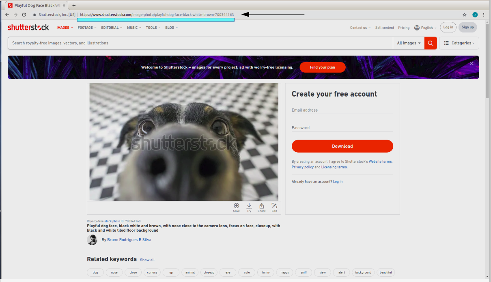
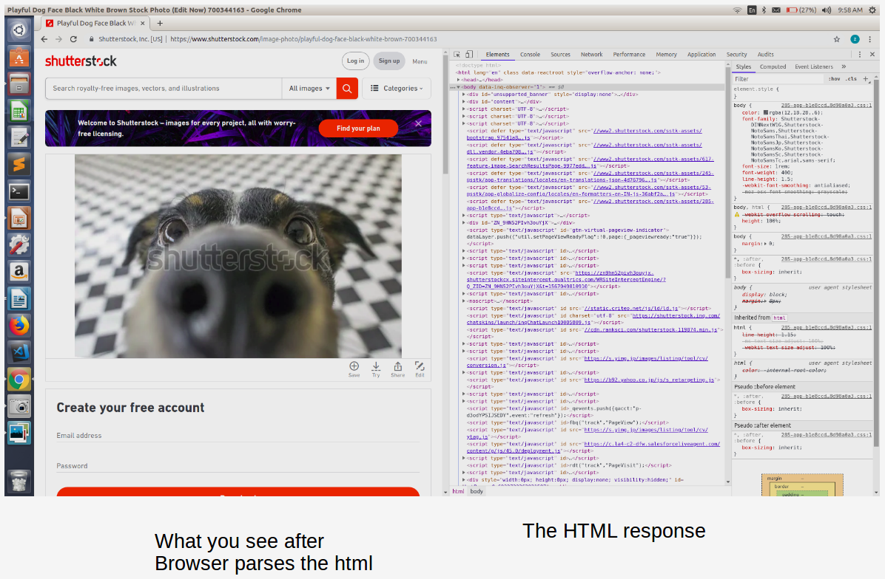

If you have no  idea of how a website works just chill we will make sure you do after this blog post.
So have you ever visited a website?
If you have not then you are probably lying or dont know what a website means.To be as elementary as possible whenever you open a browser and search something and go to a link you reach a website .(Infact google itself is a website) .A website has several webpages.To begin with let us first look at  a webpage .

In the above picture i have highlighted what is called a **url**.(If you dont know what it is it basically uniquely identify any resource in the web ).

So whenever we go to a url there are a few things that happen behind the scenes.
The first thing that our computer needs to figure out is what IP address should it send the request to.
Thus , your query is submitted to your **ISP** (Internet Service Provider ) .Within your ISP , the DNS takes the Domain name and turns it into an IP address.Something like
   www.shutterstock.com -> 23.235.89.175
The IP address is the unique locator for what is called a **server** .A server is nothing but a program running on a CPU and responds to http requests.You can imagine http request as a packet containing all the information about your request (eg the specific page you asked for,etc ) .If you are still  wondering how the request looks like we will see in detail about the request in a later post.

Taking a step back , whenever we go to a url a request is sent to the desired IP address via HTTP.Now your request travels via various routers present through out the world to finally arrive at the server.

Now the server gets that request figures out what to do ,may consult a database and responds to the request with combination of HTML,CSS,Javascript .For example when our shuttlestock server recieves the above request it extracts from the request the exact image required and extract the image from the database prepares an html page and sends the page back to you as an http response.Now your browser parses the response to show you what you see.

This completes the basics of how internet works.Watch [This video][https://www.youtube.com/watch?v=qEdv_pem-JM&feature=share] to understand visually.
In the [next](/http-in-depth) blog we will dive into the anatomy of an http request.Lot more to come stay tuned.